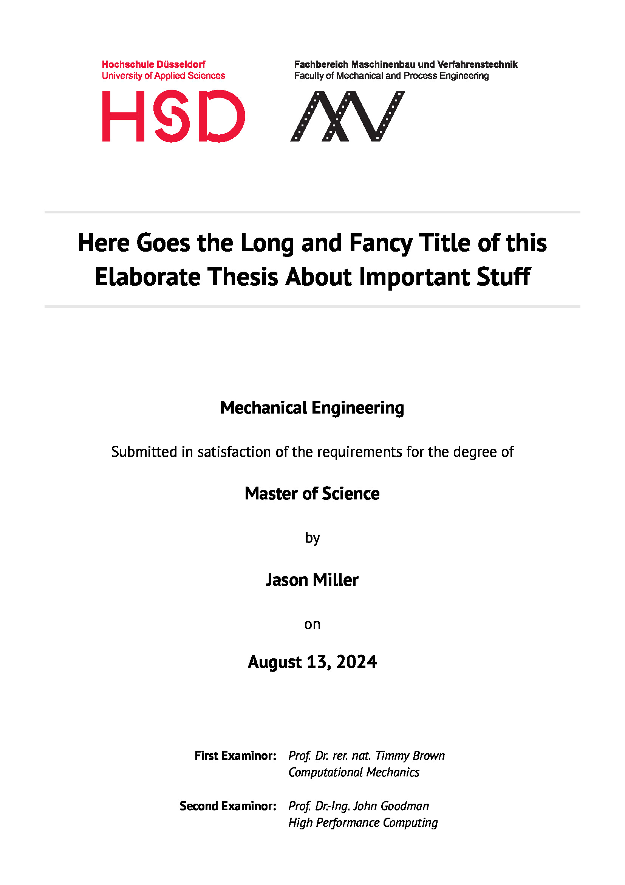
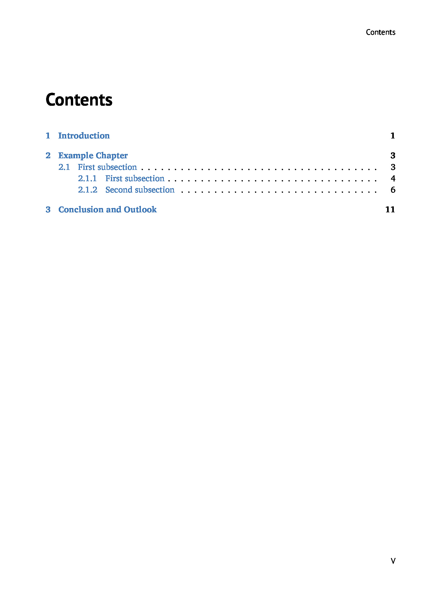
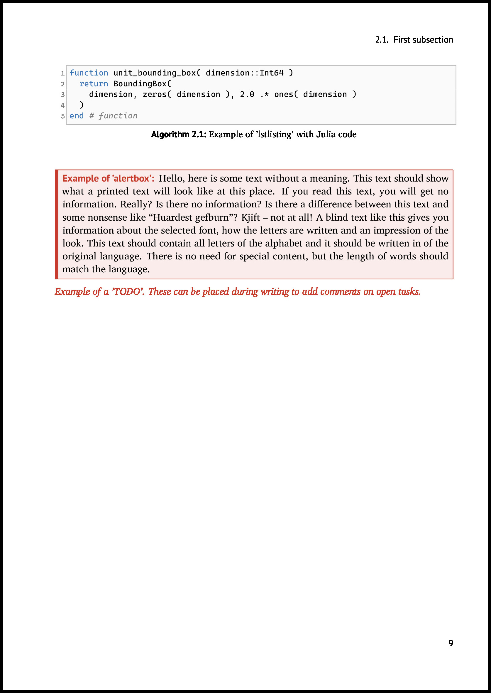
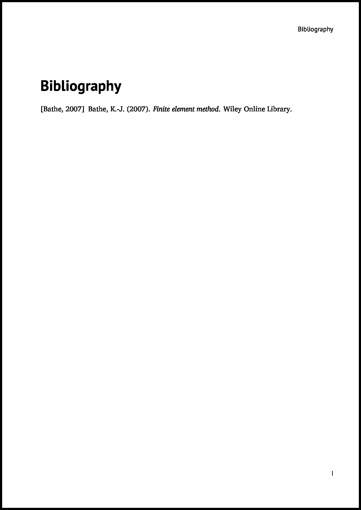
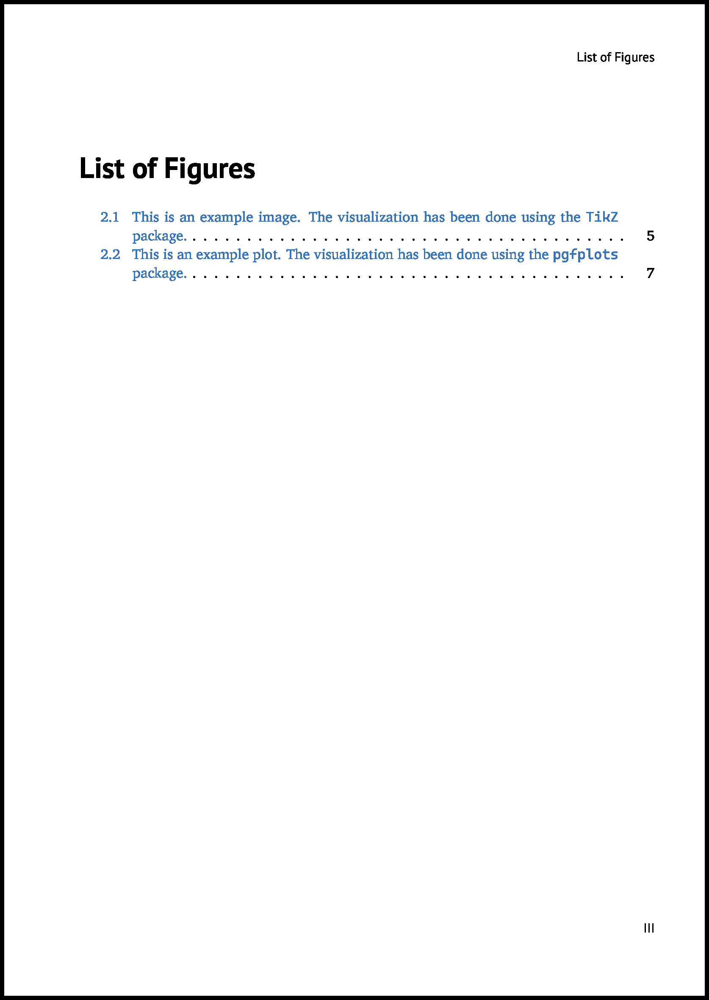
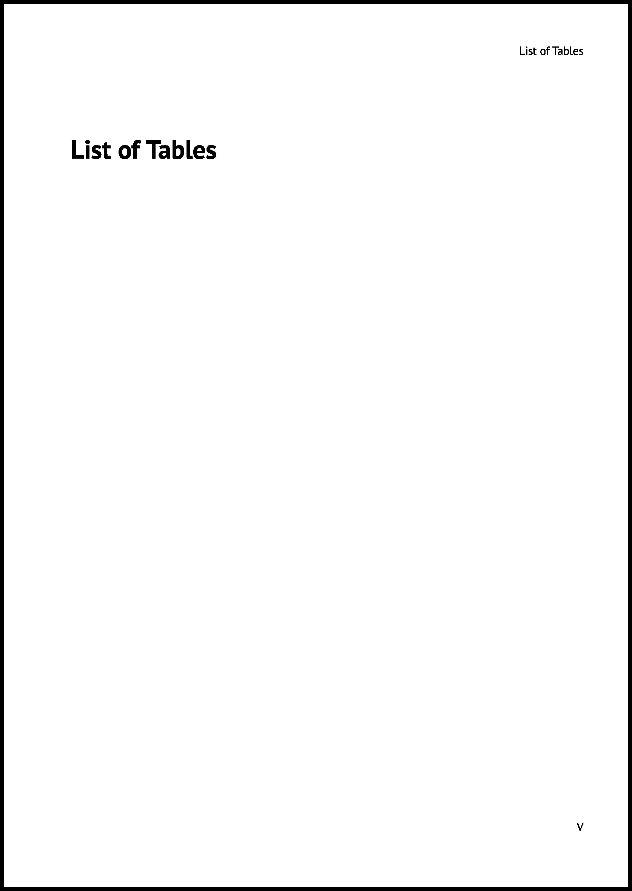

# LaTeX Thesis
This repository provides a document class ```thesis.cls``` alongside an example ```master.tex``` for typesetting a academic thesis in LaTeX.
The provided example is made for students at the *Hochschule Düsseldorf*. Nevertheless, changing the university logo and name is pretty straight forward.

## Building the document
Building the document is easy, first you need a ```LaTeX``` installation, on macOS this can be done using ```homebrew```
```sh
brew install texlive
```
This also comes with ```latexmk``` which lets us build the document with
```sh
latexmk -pdf
```
This will automatically compile every file with a ```.tex``` ending in the current directory.
If you have alot of ```TikZ``` grahpics in you thesis, resulting in long compile times, you should enable the externalize feature from tikz.
Just create an empty directory ```figures``` next to you master.tex and add ```\tikzexternalize[prefix = figures/]``` to your preamble.
In order for the document to properly compile you also have to add the ```-shell-escape``` flag to ```latexmk```.

## Screenshots

Here are a few screenshots of the ```pdf``` produced by the example:
<p align = "center">
    <br>
</p>
<p align = "center">
     <br>
</p>
<p align = "center">
     <br>
</p>
<p align = "center">
     <br>
</p>
<p align = "center">
     <br>
</p>
<p align = "center">
     <br>
</p>
<p align = "center">
     <br>
</p>
<p align = "center">
     <br>
</p>
<p align = "center">
     <br>
</p>
